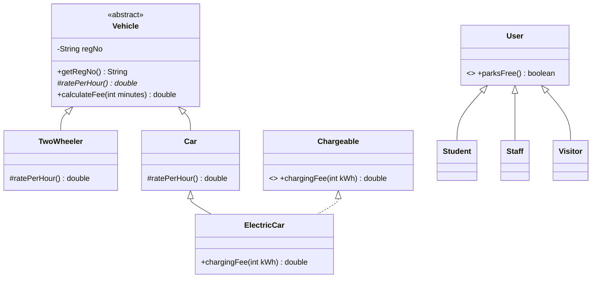

# Task 6 - UML class diagram (paste into https://mermaid.live or a Markdown viewer that supports Mermaid)

```mermaid
classDiagram
    class Vehicle {
        <<abstract>>
        -String regNo
        +getRegNo() String
        #ratePerHour() double*
        +calculateFee(int minutes) double
    }
    class TwoWheeler { #ratePerHour() double }
    class Car { #ratePerHour() double }
    class ElectricCar { +chargingFee(int kWh) double }
    class Chargeable { <<interface>> +chargingFee(int kWh) double }
    class User { <<abstract>> +parksFree() boolean }
    class Student
    class Staff
    class Visitor
    Vehicle <|-- TwoWheeler
    Vehicle <|-- Car
    Car <|-- ElectricCar
    Chargeable <|.. ElectricCar
    User <|-- Student
    User <|-- Staff
    User <|-- Visitor
```
